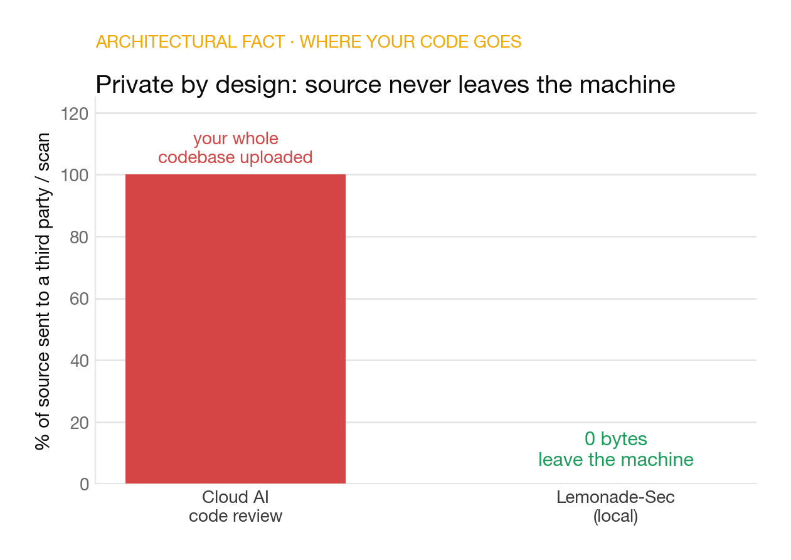
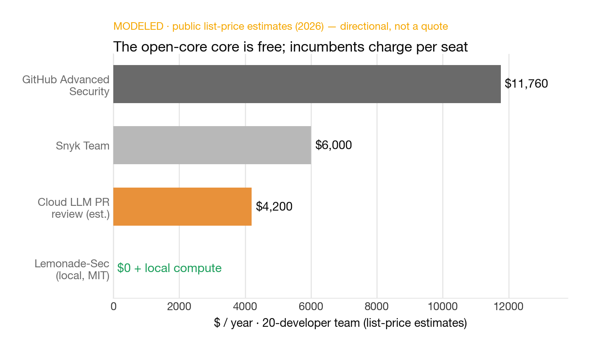
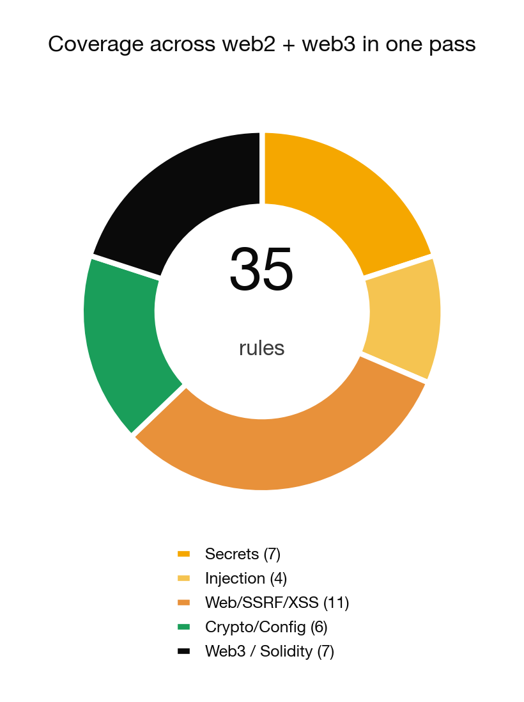
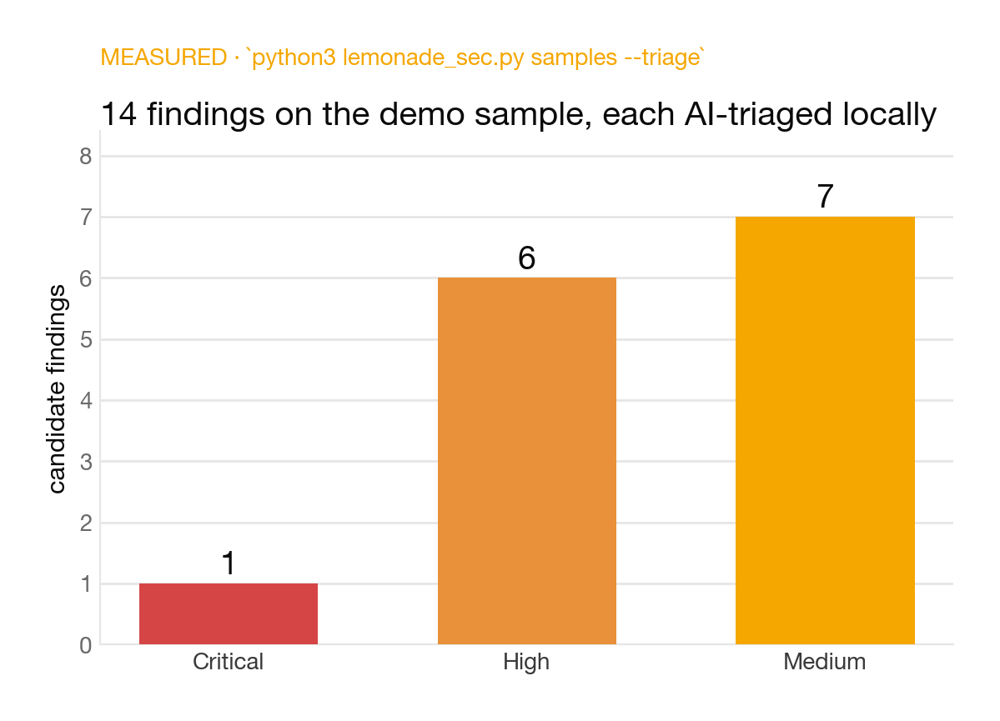

# Lemonade-Sec 🍋🔒

**A private-by-design AI security code reviewer, powered by [Lemonade](https://lemonade-server.ai).**

Lemonade-Sec scans your code for vulnerabilities and then has a **local LLM triage every
finding** — verdict, exploitability, and a concrete proof-of-concept idea. Because the model
runs on your own machine through Lemonade's OpenAI-compatible server, **your source code
never leaves the machine.**

> Cloud AI code review means uploading your proprietary source to someone else's servers.
> For regulated, air-gapped, or simply confidential codebases that's a non-starter.
> Lemonade-Sec runs the **entire** pipeline — static analysis *and* AI reasoning — locally.

---

## Why local matters here

| | Cloud AI reviewer | **Lemonade-Sec** |
|---|---|---|
| Where your source goes | uploaded to a SaaS | **stays on your box** |
| Works air-gapped / offline | ❌ | ✅ (offline heuristic fallback) |
| Per-scan cost / API keys | $ + keys | **free, no keys** |
| Data-retention risk | vendor policy | **none — nothing leaves** |

Security review is exactly the workload you *don't* want to send to a third party. Local
inference makes AI-assisted review usable for teams that could never paste their code into a
cloud chatbot.

<p align="center">
  
  
</p>
<p align="center">
  
  
</p>

<sub>Charts regenerate from source: `python3 scripts/make_charts.py`. Rule counts are read
from `rules.py` (measured); economics are labelled MODELED (public list-price estimates).</sub>

## How it works

1. **SAST core** — a regex rule set (35 rules across web2 **and** web3/Solidity: secrets,
   injection, SSRF, deserialization, XSS, weak crypto, JWT, reentrancy, arbitrary
   `delegatecall`, and more) flags *candidate* findings with CWE + remediation.
2. **Local AI triage** — each candidate, its code context, and a class-specific attack
   playbook are sent to your **Lemonade** model (`/v1/chat/completions`). It returns a strict
   JSON verdict: `true_positive | false_positive | uncertain`, a confidence, reasoning, and a
   PoC idea.
3. **OpenAI-compatible** — Lemonade speaks the OpenAI schema, so Lemonade-Sec auto-discovers
   your running model via `/models` and just works. Point it anywhere with `--lemonade-url`.
4. **Graceful offline fallback** — no server running? Add `--offline` (or let it detect the
   server is down) and triage falls back to a built-in heuristic grounded in the same
   playbook. You always get a report; you never get a network call you didn't ask for.

## Quickstart

```bash
# 1) Install & start Lemonade  →  https://lemonade-server.ai
lemonade-server serve            # serves an OpenAI-compatible API on :8000
lemonade-server pull Qwen2.5-Coder-7B-Instruct-GGUF   # any coder/instruct model works

# 2) Scan the bundled vulnerable sample with LOCAL-AI triage
git clone https://github.com/SRKRZ23/lemonade-sec && cd lemonade-sec
python3 lemonade_sec.py samples --triage

# Scan your own repo (fully offline, no server needed):
python3 lemonade_sec.py ./myrepo --triage --offline --out report.md --json findings.json
```

No pip install, no dependencies — **Python 3 standard library only.**

### Example output

```
🔒 Lemonade LOCAL AI online at http://localhost:8000/api/v1 — model 'Qwen2.5-Coder-7B'.
   Your source code stays on this machine.
Lemonade-Sec: scanned 1 files → 14 candidates (1 crit, 6 high, 7 med, 0 low)
report → lemonade_sec_report.md
```

```markdown
### Stripe live secret key  ·  `SEC-STRIPE` · CWE-798
- **Location:** `samples/vuln_sample.py:3`
- **AI triage** (lemonade:Qwen2.5-Coder-7B): `true_positive` (conf 0.9) — a live Stripe
  secret key is hardcoded and reachable in source.
  - **PoC idea:** Confirm the key is live via a read-only auth call, then rotate immediately.
```

## Usage

```
python3 lemonade_sec.py <path> [options]
  --triage              triage findings with the local Lemonade model (else offline)
  --lemonade-url URL    Lemonade base URL (default http://localhost:8000/api/v1)
  --model ID            pin a model id (default: auto-pick from /models)
  --offline             skip the server entirely; heuristic triage only
  --scope scope.json    authorization gate — refuse to scan outside authorized_paths
  --out FILE            markdown report (default lemonade_sec_report.md)
  --json FILE           also write findings JSON
```

## Authorized use only

Lemonade-Sec is for reviewing code **you own or are explicitly authorized to test** (your
repos, your employer's with permission, or a bug-bounty program whose rules authorize you —
use `--scope` to hard-gate the target). Findings are **candidates**, not proof: confirm
reachability and build a real PoC before acting on anything.

## Roadmap

- Stream triage concurrently across findings for large repos
- `--sarif` output for CI / code-scanning integration
- Optional AST-based taint tracking to cut false positives
- Ship as a Lemonade "app" in the marketplace

## License

MIT © 2026 Sardor Razikov. Built for the **AMD Lemonade Developer Challenge** — an
open-source contribution to the local-AI ecosystem. Contributions welcome.
